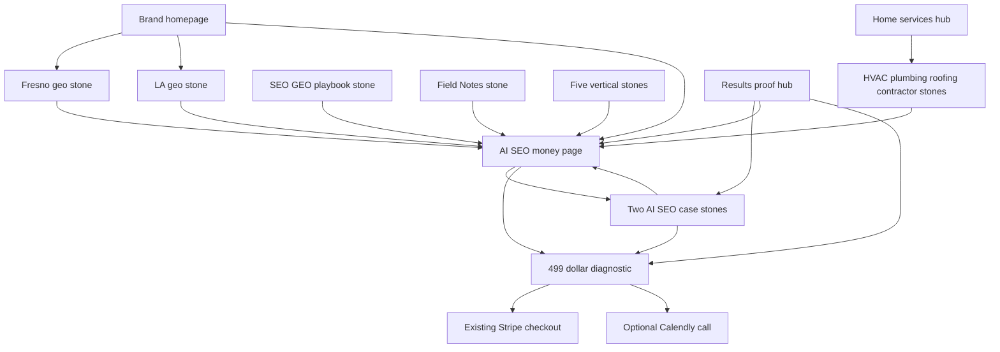

# AMG site strategy and working-tree handoff

Prepared September 7, 2026. Scope: all 33 HTML files in `/Users/amir/amgwebsite`, shared browser code, lead receiver, Vercel routes, sitemap, robots and llms.txt. Engine context was read only. No commits, deployments, ad-account changes, spend, messages, live leads or payments were created. The earlier results rebuild and its two untracked case studies were present at entry and preserved.

## POSITIONING

### What the buyer is buying

**AMG helps a good business become the business people find, trust, and contact, then helps it turn that attention into paid work.** The customer wants the next call, a fuller schedule, better inquiries, repeat orders, and less time chasing people. AI visibility is a way into that conversation. Software is how AMG does the work, not the product the owner is buying.

**One-sentence promise:** “We help the right customers find you, trust you, and hire you, with dated evidence of what changed.”

This is a promise about the direction and accountability of the work, not guaranteed lead volume or control over an AI answer. The sharper AI SEO offer is: “When buyers ask AI who to hire, we work to make your business one of the names they hear.” Immediately name the payoff: being considered for the next call or order. A citation is a leading signal, not a sale.

**Category:** a Fresno creative agency, human-led and AI-powered. AMG brings strategy, original creative, search visibility, conversion and follow-up together. The owner works with a responsible person. There is no platform subscription to operate and no bot roster to buy. AMG's accumulated client knowledge, consistent execution, original material, and evidence history are the advantage. Model access is available to competitors too. [Standing mission decisions; engine war plan, opening and “AMG LEAD ENGINE.”](../amg-seo-engine/outputs/astra_24x7_war_plan_2026-09-07.md)

### To whom

The five practices stay: home services, legal, healthcare, finance, and B2B. They are distinct buying situations inside one business model, not five equal acquisition bets that must all launch together.

| Practice | Buyer's words | Fit and proof requirement |
|---|---|---|
| Home services | “The phone should ring for work we can actually take. We cannot keep losing inquiries while we are on the job.” | Established operator, real service area, capacity to answer and fulfill. Fresno HVAC is the documented first candidate cell, subject to current winnability, not a proven best market. Crane evidence is adjacent trades evidence, not an HVAC result. |
| Legal | “We need the right prospective clients to find us and reach intake.” | Practice-specific economics, attorney review of claims, intake dispositions. No invented case values or borrowed $100 CPCs. |
| Healthcare | “We need patients who fit the practice, and we need their information handled properly.” | Practitioner expertise, inquiry-to-appointment measurement, appropriate handling of sensitive data. Existing testimonial is not a quantified appointment lift. |
| Finance | “We need prospective clients who trust us enough to start a conversation.” | Trust, service fit, approved communications, long-cycle qualification. Do not conflate lender, CPA, advisor and insurance demand. |
| B2B | “Put us on the supplier shortlist and turn inquiries into quotes and repeat orders.” | Distributor/manufacturer with a clear capability or catalog advantage. Quality Beverage is the closest current quantified search-traffic evidence. |

The smallest viable market is an owner with an established service, a reputation worth making visible, capacity for more good work, and enough margin to support a scoped engagement from $2,000/month. “Every small business needs AI” is not a fit definition. One extra job paying for everything is not a fact until the owner's contribution margin supports it.

Fresno and the Central Valley are the home market. National brands are a separate scope within the same offers: entity clarity, topical authority and digital PR wherever buyers research them. Do not force a national buyer into a Google Maps story. Keep `/ai-seo` geo-neutral. Existing LA content is allowed; LA remains an outbound holdout. Neither the LA page nor national demand authorizes geographic spending. Phoenix expansion and “LA address coming soon” remain stale commitments to review, not established additional offices.

Amir's standing decision is that healthcare and finance work runs with E2E encryption and a HIPAA/SOC2 posture. That is a credible high-value buying reason when explained in terms of protecting client and patient information. The site currently reduces it to “compliance-aware.” Proposed language: “For healthcare and finance, sensitive information stays within the agreed encrypted workflow, with access and approvals scoped before the work begins.” Pair that with an approved description of the E2E boundary and HIPAA/SOC2 posture. Do not silently turn posture into an independent certification or imply that the public marketing site, Stripe, Calendly and every analytics tool form one E2E-encrypted system. This audit did not test that infrastructure. This is a communication scope issue, not a reason to erase the standing decision.

### Against whom

| Alternative | Why a reasonable owner chooses it | AMG's defensible answer |
|---|---|---|
| Established Fresno agencies | Local reputation, referrals, known people, visible work, less perceived risk. | Show a relevant dated client record and who owns the next result. Respect incumbent relationships. “They bolted AI on” is unverified and does not explain the buyer benefit. |
| Sequoia GEO and other focused AI-search agencies | A specialist already speaks the owner's language and makes evidence easy to inspect. | Earn the preference through the actual creative, the diagnostic depth, relevant proof and reliable delivery. “We measure” and “founder-led” are not exclusive. |
| DIY or an employee using AI | Lower cash cost, control, already understands the business. | The owner pays AMG for judgment, production, maintenance and completion without adding another job to the week. Do not insult the nephew. |
| Platforms and self-serve tools | Convenient setup, lower entry cost, familiar subscription purchase. | AMG is responsible for doing the work and checking the outcome. A tool can be useful; the owner is buying the work being handled. |
| Doing nothing, relying on referrals | Referrals already work; attention and money are limited. | Verify one real gap before proposing work. Protect the reputation they have earned. If there is no useful gap or the economics do not fit, say so. |

**The competitor evidence changed.** The August 29 internal pricing scan said Sequoia lacked a low-risk entry. Its current homepage offers a free, human-reviewed AI Search Snapshot and publishes evidence limits. That invalidates the “only we offer a low-risk first step” argument. AMG's paid diagnostic needs to earn its fee through owner-specific inquiry handling, economics and a usable plan. [Sequoia homepage, read September 7](https://www.sequoiageo.com/).

Sequoia's current pricing page starts Search Foundation at $2,500/month with a 90-day initial term, then month to month. Its marketing leadership scope starts higher. AMG's $2,000 SEO starting point is below that first figure, but scope differs; it is not proof AMG is cheaper for the same work. The older memo's $500-premium rationale is obsolete. [Current competitor pricing](https://www.sequoiageo.com/ai-seo-pricing). The other agencies in the [August pricing scan](../amg-seo-engine/docs/fresno_pricing_intel_2026_08_29.md) are historical context. AMARQUEZ's pricing page could not be retrieved in this check, so I make no updated price claim about it.

### Why now, and the wedge

The reason to act is a buyer choosing now while the business is absent from a relevant answer or losing an actual inquiry. It is not a countdown, universal claim that clicks have vanished, or a claim that every competitor is technically backward.

The wedge is specific: an exact buyer question, the service and market, the AI surface and whether search was enabled, the capture date, the rival named, and the prospect's observed omission. Show the answer and then explain: “A buyer asking this question was given that business to consider. Your business was absent from this answer.” Repeat comparable questions before claiming a persistent pattern. Do not infer a lost sale, a fixed share of all buyers, or a monthly dollar loss from a single omission. A missing/error response is not zero visibility. Dates and answer excerpts are buyer evidence; the models, orchestration, and engine internals remain private. [Cold-call wedge](../amg-seo-engine/docs/amg_hvac_cold_call_plan.md); [war plan, acquisition evidence rules](../amg-seo-engine/outputs/astra_24x7_war_plan_2026-09-07.md).

Original expertise becomes useful search content. The same ideas become social creative. Buyers recognize and verify the business, contact it, and receive a useful response. Search citations and actual sales questions inform the next piece. That is the compounding system. The relationship among SEO, social, conversion, citations and sales is not a guaranteed causal sequence for every lead; measure the steps separately.

### The proof AMG actually has

- Amir says AMG has **never received an inbound lead**. Three paying clients came from outbound and relationships. Do not relabel their origin, an internal test, or a cold-email reply as the first inbound win.
- Quality Beverage's recorded 28-day organic sessions rose from 39 on July 6 to 77 on September 5, a difference of 38. Its prior weekly comparison declined. Google clicks in the latest capture remain below August 22. This is search-traffic evidence.
- Patriot's recorded 28-day Google clicks rose from 0 on August 20 to 8 on September 5. These are the first clicks in the supplied comparison series, not proof of the business's first-ever Google visitor, nor booked lifts.
- Fresno Distributing's latest comparison adds 1,832 impressions but only one Google click. Visibility is ahead of the demonstrated customer payoff.
- No new comparable AI-naming gain, verified revenue delta, booked-job delta or deduplicated qualified-call result is supported by this results source set. Do not put them in headlines, ad claims or the diagnostic cost model as facts.

These figures were checked against the four `outputs/gsc_snapshot_DATE.json` files and Quality Beverage's `perf_history.jsonl` cited in [ASTRA_RESULTS_REPORT.md](ASTRA_RESULTS_REPORT.md). Founder credentials and reviews can support trust but cannot substitute for acquisition results. The evidence supports “here is measured progress and what remains unknown,” not “our proven inbound machine.”

### Price architecture and voice

**$499 diagnostic, credited toward work. Ongoing SEO starts at $2,000/month and is scoped after diagnosis.** The diagnostic is paid professional work the customer keeps. The free discovery call is a way to establish fit, not a competing free diagnostic. Standalone website work can be scoped without a retainer, as the current site says; do not revive the $999 build. No new tiers, production quotas or contract minimums are introduced here.

The site already states a 30-day credit condition and two-week diagnostic delivery. The current mission establishes the price and credit, but does not independently reconfirm those terms; I retained them and flagged consistency for Amir. The HVAC call plan describes a 45-minute assessment while the site describes two weeks plus a live call. Decide whether these describe the same engagement and make the deliverable exact. Public navigation must not advertise one product while the call sheet sells another.

What the Godin voice requires: respect the owner's existing success, be precise about fit, show useful proof, make the next step understandable, and permit “not now.” Strong existing passages include the referral story in Field Notes and “You do the work. We make sure they find you.” Weak passages blame, sneer or sell certainty: “Everyone else self-selects out,” “free work attracts people who aren't buying anything,” “your nephew ... cannot see the board,” “Nobody scrolls down there anymore,” and “switching agencies means rebuilding ... That's the moat.” The last directly contradicts the repeated no-lock-in promise.

**Proposed narrative replacements outside results, not applied:**

| Location | Current problem | Concrete replacement direction |
|---|---|---|
| Homepage hero/intro | AI category and multi-city identity lead; owner payoff arrives after the label. | “Get found by the people who need your business.” Subhead: “AMG is a Fresno creative agency helping owners turn a good reputation into calls, customers, and repeat work. We handle the marketing and show you what changed.” |
| Global navigation/footers | “AI-native, not AI-powered,” agent/workflow menu, a narrow home-service identity on a five-vertical site. | “Human-led. AI-powered.” Describe the service links by the owner benefit while preserving clear search terms on their destination pages. Position AMG as the creative agency across all five practices. |
| `/diagnostic` | A “hard number” on revenue lost to invisibility promises causality the measurement cannot establish. | “See who buyers are being shown, where inquiries fall through, and which changes are worth paying for.” Label dollar estimates as scenarios built from the owner's supplied economics. |
| `/pricing` | “Pays for itself” and “effectively free” hide the fact that this is paid analysis and conditional invoice credit. | “The diagnostic costs $499. You keep the findings. If you engage within the stated credit window, that payment reduces your first invoice.” |
| `/ai-seo` | Universal AI-buyer behavior, “no ads,” “already decided,” unsupported before-to-after AI story. | Keep AI SEO in the H1: “AI SEO that helps buyers find your business.” Explain dated recommendations, a chance to be considered, and measured inquiries. Separate historic visibility readings from demonstrated gains. |
| Fresno | Mixed marketing/AI title and H1, four-lane FAQ, old client claims, hostility to DIY. | H1 proposal: “A Fresno marketing agency for the next call, order, or appointment.” Explain the current diagnostic, relevant local proof and the five practices. The title and lane count are already corrected. |
| LA | Long founder elegy before the offer; absence of AMG becomes a claim that nobody had results; promised future address. | Keep the personal connection shorter. State Fresno base and remote LA service honestly. Show only an exact dated LA observation with its true scope. |
| Workflows and agents | Public implementation diagrams, absolute capability claims, a second overlapping service identity. | Show the missed inquiry, the timely response, and the owner's next action. Keep proprietary methods private. Make `/ai-workflows` supporting context beneath a single scoped operations offer, or consolidate it after query evidence. |
| Finance and healthcare | “Compliance-aware” understates the standing posture; dentist-first H1 hides the wider practice. | Explain protected handling and human approval in buyer language, with the exact approved E2E/HIPAA/SOC2 scope. Finance should distinguish advisor/CPA/lending needs; healthcare should speak to practices beyond dentistry. |
| Calculator | Hardcoded improvement rates and CPLs presented as “2026 numbers, not guesses,” plus agency fees omitted. | Replace with owner-entered assumptions and a fully loaded cost model, or retire the promotional comparison. Label every non-observed input before displaying a result. |
| National wing | Almost everything returns to local map-pack logic. | Add a concise local-versus-national section within `/ai-seo`: national supplier/category demand, authority, earned press and buyer verification. No new competing national AI SEO money page. |

## SITE AUDIT

### Architecture and observed demand

The review found 31 intended public pages and two film experiments. All public pages have unique canonicals and one H1. Clean URLs and existing redirects remain intact; two exact temporary redirects now keep the internal report URLs from being served as public documents. The film experiments are now noindex. The sitemap now covers all 31 intended public URLs, including the diagnostic and both proof stones. This is a source audit, not confirmation of live Google indexing.

| Page | User-supplied September 7 GSC, last 28 days | Decision |
|---|---|---|
| `/ai-seo` | 3 impressions; average position 77.7 | Keep the single money page. Repair intent, proof and links. Do not infer a page-one opportunity from national volume. |
| `/seo-geo-playbook` | 18 impressions; position 5.7 | Preserve the supporting page and its URL. High position on this small sample is not proof of commercial demand or a click gate. |
| `/ai-marketing-agency-fresno` | 394 impressions; position 18.6; 1 click | Strongest supplied geo opportunity, still almost no click history. Narrow title ownership, strengthen relevant proof and local trust. |
| `/ai-agency-los-angeles` | 23 impressions; position 6.0 | Preserve useful page; do not equate rank on zero-volume AI variants with inbound demand. LA outbound hold remains. |

Source: the figures supplied in this mission. The filesystem contains the September 5 fleet snapshot, which is a different property-level dataset. I did not substitute its totals for today's page-level figures or invent a September 7 snapshot filename. Neither impressions nor paid/social clicks satisfy the organic cornerstone click gate. [Cornerstone doctrine](../amg-seo-engine/skills/topical_authority_cornerstone.md); [SERP-first diagnosis](../amg-seo-engine/docs/serp_first_strategy_2026_07_09.md).

The intended hierarchy is one geo-neutral money page per distinct offer. `/ai-seo` owns AI SEO, AI SEO agency/services/company and the commercial GEO variants. `/seo-geo-playbook`, `/ai-search-shift`, relevant editorial stones, geo pages and proof stones support it. The vertical pages are audience-specific stones; they must explain a specific buying situation, not become duplicate AI SEO money pages. Paid management, web work and content can each retain a distinct service owner. `/ai-agents` and `/ai-workflows` still overlap in intent and require an editorial consolidation decision.

### Shared conversion and mobile findings

**There is no form in any HTML page and no local thank-you page.** The former form on `/what-ai-can-do` was removed, leaving broken JavaScript. Native phone links are present on all 31 public pages. Most commercial pages use the same Calendly 30-minute route. The diagnostic, pricing and homepage use the same Stripe Payment Link. Existing navigation labels the call “Book”; the results and AI SEO body CTAs now explicitly open the diagnostic. Checkout, booking availability, phone routing and completed transaction handling were not live-tested.

`amg-pack.v1.js` records `phone_call_click`, `booking_click`, `sms_click`, and a generic `form_submit` listener. It loads GA4/Plausible calls where those functions exist. There are no actual forms for that listener today. Its engine intake URL is empty. It stores first-touch UTM/click identifiers, decorates Calendly with source/medium/page, but does not supply a durable lead identity, completed booking/payment event, last-touch history, or Stripe purchase reconciliation. The generic form event fires on attempted submission, not accepted persistence. **Do not import it as a primary lead conversion when a form is added.**

`api/lead.js` forwards to `https://n8n.amirgetsjobs.com/hooks/lead`. It accepts email or phone, relays upstream status/body and has no explicit upstream timeout, schema for required business fields, or success receipt validation. The dated engine reviews also flag shared blocking intake and missing durable handoffs. Those are source findings, not a claim the endpoint is currently down. The comment about the old form failing for two months is an engineering history note, not proof it caused every missing inbound lead. [Engine review](../amg-seo-engine/outputs/astra_engine_review_2026-09-07.md); [Grok review](../amg-seo-engine/outputs/astra_grok_review_2026-09-07.md).

Most pages collapse navigation at 600px; the results family uses 900px. Long menus may crowd tablet widths. Several pages reveal content through IntersectionObserver, animate words/diagrams, and use large background media; source breakpoints do not prove usable scrolling or fast rendering. Most older pages also lack a main landmark. I synchronized existing mobile menu expanded-state attributes without changing layout. The results tables retain named keyboard-focusable horizontal scroll regions, readable minimum widths and stacked cards. No connected browser was available; exact wrapping, keyboard focus, swipe behavior, contrast, font loading, cumulative layout shift and real speed remain unmeasured. These are risks, not fabricated Lighthouse scores.

### Prioritized fix list

| Priority / ID | Finding and action | Status |
|---|---|---|
| P0 C1 | `/what-ai-can-do` dereferenced deleted `lfTradeChips` before initial render and booking handler. Removed dead references; native Calendly href replaces `#`; spend heading now follows selection. | **APPLIED**, original crash reproduced and fixed behavior tested offline. |
| P0 C2 | No verified accepted inquiry -> durable receipt -> owner response -> paid diagnostic chain. Specify and test one form/booking/payment path before paid traffic; errors must not display success. | **OPEN**, account/engine integration and deployment verification needed. No live submission sent. |
| P0 C4 | Internal reports sit in the static site root and could ship with a deployment. Added `.vercelignore` for `ASTRA_*.md` and exact temporary redirects for both report URLs to `/` in `vercel.json`. | **APPLIED** locally; Claude must verify exclusion and report URL behavior in the deployed artifact. |
| P0 C3 | Phone/booking clicks exist; qualified calls and paid diagnostics do not have a verified conversion implementation. | **OPEN**, exact event contract below. Required to judge an ad test. |
| P1 P1 | $3,000 engagement floor contradicts standing $2,000 SEO floor. | **APPLIED** on seven pages, including visible FAQ, matching metadata and schema. The homepage's separate illustrative $3,000 customer total was not a price and remains. |
| P1 P2 | Old $999 build / $1,500 monthly / $1,499-$2,499-$3,999 tier remnants. | **NONE FOUND** in current public HTML/JS/llms copy. Historic engine documents still conflict and were left read only. |
| P1 P3 | “Free audit” on workflows contradicted the paid diagnostic; Fresno FAQ omitted finance and said four lanes. | **APPLIED**: $499 diagnostic; five lanes including finance. |
| P1 P4 | Homepage and Fresno title split local ownership; PPC money page was titled as Fresno-only. | **APPLIED**: brand creative-agency homepage; “Marketing Agency in Fresno”; geo-neutral “PPC Agency” title. Matching social title strings updated. Existing URLs/H1/body remain. Monitor exact page/query clicks after deployment, especially the existing Fresno PPC query, before further title changes. |
| P1 P5 | Playbook still had a direct Calendly CTA despite the reported consolidation. Other diagnostic-intent CTAs went to homepage pricing. | **APPLIED**: playbook CTAs to `/ai-seo`; five “See where you stand” routes to `/diagnostic`; AI SEO and results body CTAs to diagnostic. Optional navigation call remains on other pages. |
| P1 P6 | Weak contextual proof distribution and destination labels still saying “playbook” when linking to the offer. | **APPLIED**: AI SEO links directly to both cases; B2B to Quality Beverage; trades hub and contractor page to Patriot; Field Notes and the search-shift article link up to AI SEO. Money-page link labels now share “AI SEO” and describe the destination. Relative HTML page links normalized. |
| P1 P7 | Homepage, Fresno, LA, pricing, AI SEO and llms.txt repeat proof that the results source audit withdrew or bounded. | **PROPOSED**, requires narrative cleanup outside authorized results scope. Specific conflicts in per-page entries below. Do before using those narratives in ads. |
| P1 P8 | Tools/model roster, buyer insults, invented illustration economics and absolute outcome language weaken trust. | **PROPOSED**, exact rewrite directions in POSITIONING and page entries. Calculator mechanics are fixed; its economics are not validated by that fix. |
| P1 P9 | Healthcare/finance posture and national wing absent or understated. | **PROPOSED**, add buyer-facing scope with approved evidence. No invented certification badge. |
| P1 P10 | Diagnostic omitted from sitemap; film experiments indexable. | **APPLIED**: diagnostic and legal utility URLs added, case studies retained, both experiments noindex. |
| P2 U1 | Mobile burger/dropdown state changed visually without updating aria-expanded. | **APPLIED** across shared menu pages; existing results behavior retained. |
| P2 U2 | Tablet menu fit, animation fallback, long geo films, crowded calculator funnel, missing main landmarks. | **OPEN**, rendered mobile/accessibility review before release. |
| P2 U3 | Em dash in public film script comment. | **APPLIED**. No em dash characters/entities in public HTML after checks. |
| P2 U4 | Public llms.txt omits finance and repeats old proof/address claims; footer identity differs from standing creative-agency position. Terms and privacy lag the desired service/measurement scope. | **PROPOSED**, no legal-policy rewrite or new tracking consent assertions made. |

### Every HTML page: role, copy, intent and controls

All titles below are the **post-fix working-tree titles**. For every public page: phone links exist, HTML forms = 0, local thank-you states = 0. Completed booking/payment and call depth remain unverified. “Book” means the same [Calendly route](https://calendly.com/amir-amirgetsjobs/30min); “Buy” means the existing [Stripe Payment Link](https://buy.stripe.com/00w9AL0JC48r8Yd504bAs01), not a verified payment event. The exact internal edges follow this inventory.

#### `/`

**Role:** Brand gateway. **Target words:** AMG / AmirGetsJobs; creative agency.

**Title:** AMG Creative Agency · Get Found. Get Clients. · AmirGetsJobs

**Copy / cannibalization / doctrine:** Title no longer competes for Fresno/LA/Phoenix. H1 and body still lead with AI rather than the creative-agency promise. Model logos, operational diagrams and the switching-cost “moat” expose the how. Mock competitor names, ratings and profit arithmetic are not receipts. Adobe retail numbers are presented as local-client outcomes. July AI readings and map-pack claim exceed the new proof scope. Two entry options bury the paid diagnostic low on a long page.

**CTA:** “Book a call with Amir →” → Calendly; “Book a call with Amir” → Calendly; “Buy” → Stripe

**Mobile:** Long scroll, animated SVG examples, word rotation and media; no main landmark. Check 320px through tablet and reduced motion.

#### `/ai-marketing-agency-fresno`

**Role:** Geo stone. **Target words:** marketing agency fresno; secondary seo company fresno.

**Title:** Marketing Agency in Fresno · AmirGetsJobs

**Copy / cannibalization / doctrine:** Fresno owns the local marketing-agency intent. Title narrowed; H1 still mixes marketing and AI agency. One supplied GSC click merits repair, not a new geo cluster. Four-lane error fixed. “Last month,” over-80-percent AI proof, medical patient quality, construction speed and PE consolidation need dated sources or removal. “Ask AI” is a demonstration, not a predictable testimonial. Add a relevant result before the film; keep the national offer upstairs.

**CTA:** “Book a Fresno strategy call →” → Calendly; “Start a project →” → Calendly

**Mobile:** Long film/scene experience; tablet navigation remains at 600px. Verify playback controls, poster fallback and CTA before scrolling.

#### `/ai-agency-los-angeles`

**Role:** Geo stone. **Target words:** marketing agency los angeles; current page targets ai agency los angeles.

**Title:** AI Marketing Agency in Los Angeles | AmirGetsJobs

**Copy / cannibalization / doctrine:** AI-flavored local demand is zero in supplied volume data; do not chase rank alone. LA story precedes the actual commercial help. “Zero cited a measured result” is different from the July source recording zero AMG mentions. Over-80-percent claim, weekly claims, “no long contracts” in schema and future LA address need reconciliation. Strong overlap with homepage city identity was reduced by the homepage title edit. LA outbound remains held; page retention is allowed.

**CTA:** “Book an LA strategy call →” → Calendly

**Mobile:** Long video/personal-photo sequence and late pricing; navigation at 600px; phone CTA must remain accessible.

#### `/ai-seo`

**Role:** Money page, canonical offer owner. **Target words:** ai seo; ai seo agency/services/company; commercial GEO.

**Title:** AI SEO: Get Named When Customers Ask AI Who to Hire · AmirGets

**Copy / cannibalization / doctrine:** Keep one offer owner and self-canonical. Primary body CTA now opens diagnostic; direct links to both case stones added. H1 lacks literal “AI SEO,” which weakens paid message match and doctrine overlap. Historical 8/10 data cannot establish unknown-to-recommended improvement. Results link no longer proves that old AI claim. “AI does not show ads,” buyers “already decided,” and future model memory are overclaims. Propose corrected proof and national scope, not another money page.

**CTA:** “See the $499 diagnostic →” → /diagnostic

**Mobile:** Reveal-dependent sections and small receipt text; verify CTA and proof in initial mobile viewport. No main landmark.

#### `/seo-geo-playbook`

**Role:** Supporting stone. **Target words:** AI SEO and GEO explained; SEO versus GEO.

**Title:** Inside the AI SEO & GEO Playbook: The Plays, Step by Step · AmirGets

**Copy / cannibalization / doctrine:** Retained instructional title/URL and link-up banner. Its offer and navigation CTAs now go to AI SEO. Body still resembles a service pitch and largely duplicates the offer FAQ. Methods are generic fundamentals, but “plays we run” and implementation-first framing conflict with private-how direction; propose an owner guide to judging evidence. Map and AI are different surfaces, not one algorithm. Retain useful support; do not promote back to money page.

**CTA:** “Explore AI SEO →” → /ai-seo

**Mobile:** Full-height scenes and disclosure sections; verify mobile reading flow and navigation. No main landmark.

#### `/ai-search-shift`

**Role:** Supporting stone. **Target words:** AI search changes; AI SEO buyer behavior.

**Title:** The AI Search Shift · AmirGets

**Copy / cannibalization / doctrine:** Strong conceptual stone, but “the click disappeared,” “whole game” and “everyone else” erase ordinary search and referrals. 58% zero-click claim has no exact source. Adobe ecommerce evidence is generalized to every service buyer. Body service link now points directly up to AI SEO, and the diagnostic CTA routes directly to the paid entry page.

**CTA:** “See where you stand →” → /diagnostic; “Talk to us” → Calendly

**Mobile:** Animated old/new comparison and reveal-dependent text; no main landmark. Ensure meaning survives animation failure.

#### `/field-notes`

**Role:** Editorial stone, not an index hub. **Target words:** word of mouth and AI search; supporting AI SEO.

**Title:** You built it on word of mouth. The machine is the new mouth. · Field Notes · AmirGets

**Copy / cannibalization / doctrine:** Best empathy on the site: respects an earned reputation. Absolutes about no cap, machines knowing who is good, and every buyer checking need restraint. Title is prose rather than a literal AI SEO query; add a short topic descriptor only with GSC intent evidence. Direct AI SEO link-up added; diagnostic link repaired. “Field Notes” navigation implies a collection but this is one article.

**CTA:** “See where you stand →” → /diagnostic; “Talk to us” → Calendly

**Mobile:** Long reading page, small byline/cross-links, 600px menu; no main landmark.

#### `/ai-agent-for-home-service-business`

**Role:** Supporting stone for /ai-agents. **Target words:** AI agent for home service business.

**Title:** What an AI agent actually does for a home service business · Field Notes · AmirGets

**Copy / cannibalization / doctrine:** Literal AI agent overlap and direct parent links are sound. Public trigger/timing/handoff details sell the how; claims “never invents,” “every time” and exact in-production workflows need scope. The first responder “usually wins” is not sourced. Rewrite toward owner problems and verifiable completion without operational internals. Diagnostic-intent CTA now repaired.

**CTA:** “See where you stand →” → /diagnostic; “Talk to us” → Calendly

**Mobile:** Long article and lower-page CTA; small cross-links and reveal effects; no main landmark.

#### `/ai-agents`

**Role:** Secondary money page, overlapping operations offer. **Target words:** AI agent development company; custom AI agents.

**Title:** AI Agent Development Company · Custom AI Agents · AmirGetsJobs

**Copy / cannibalization / doctrine:** Direct title/slug topic match, but outcome framing is subordinated to software. “Never sleeps, never forgets,” “in production” and “built or can deploy” conflate availability states. Overlaps workflows in lead response, reviews and reporting. Preserve URL now; propose one operations offer with workflows as support after exact-query evidence. Existing agent article links up here.

**CTA:** “Book a call with Amir →” → Calendly

**Mobile:** Wide flow diagrams can shrink labels or overflow; distinguish trigger/action without needing animation. No main landmark.

#### `/ai-workflows`

**Role:** Currently money-shaped; proposed operations stone. **Target words:** AI workflows; AI automation agency.

**Title:** AI Automation Agency & AI Workflows · AmirGetsJobs

**Copy / cannibalization / doctrine:** Title and copy compete with agents for custom automation. Some good owner payoff lines, but six systems, detailed timings, product stack and universal completion claims dominate. Terms retain engine IP while this page says keep everything. Paid diagnostic replaces stale free audit. Has only one body link to agents plus diagnostic; public AI SEO connection is mostly navigation.

**CTA:** “See where you stand →” → /diagnostic; “Talk to us” → Calendly

**Mobile:** Complex animated before/after diagrams, long scroll, tiny labels; no main landmark. Readability and reduced-motion fallback unverified.

#### `/content-strategy`

**Role:** Secondary money page. **Target words:** content strategy for organic and paid.

**Title:** Content Strategy for Organic & Paid · AmirGets

**Copy / cannibalization / doctrine:** Closest articulation of the flywheel: owner expertise becomes search, social and paid creative. “The page ranks. The AI quotes it” sounds automatic. “One engine, two channels” obscures the wider system. Filming/editing/distribution copy may imply production included at every SEO starting price; scope explicitly rather than add a new bundle. No separate competing content page.

**CTA:** “Book a call with Amir →” → Calendly

**Mobile:** Four-card grid drops to fewer columns; photo backgrounds and reveal text need contrast/loading checks. No main landmark.

#### `/paid-ads`

**Role:** Secondary money page, geo-neutral owner. **Target words:** PPC agency; Google Ads management; LSA management.

**Title:** PPC Agency · Google Ads & LSA Management · AmirGetsJobs

**Copy / cannibalization / doctrine:** Title made geo-neutral, Fresno PPC stays in first paragraph for existing query relevance. This sells AMG management, not a landing page for AMG bidding on AI SEO. Ads inclusion at the engagement floor remains a scope question after numeric price correction. Meta described as necessary, organic said to lower every CPC, and LSA disputes promised categorically: all need current process evidence. Do not promise every channel to every client.

**CTA:** “Book a call with Amir →” → Calendly

**Mobile:** Full-height scenes and card grid; body CTA is late, phone in footer. No main landmark.

#### `/web-design-development`

**Role:** Secondary money page. **Target words:** web design and development; website builds.

**Title:** Web Design & Development · AmirGetsJobs

**Copy / cannibalization / doctrine:** Distinct standalone offer, $499 diagnostic retained, no $999 build found. “Most clients started with one project” and “site pays for the introduction” need evidence; site build is not proven inbound. Schema minimum price 499 is the diagnostic, not website price, and risks being extracted as a build price. Split offer schema in next scoped pass. Strong connection to conversion and AI SEO retained.

**CTA:** “Book a call with Amir →” → Calendly

**Mobile:** Cards/reveal sections with late CTA; inspect ordering-system examples and text size. No main landmark.

#### `/home-services-marketing`

**Role:** Vertical hub stone. **Target words:** home service marketing agency.

**Title:** Home Service Marketing Agency · AmirGetsJobs

**Copy / cannibalization / doctrine:** Good owner H1; links down to four trade stones and up to AI SEO. “They asked AI ... it said you,” ninety-second framing and one-call winner logic imply certainty. Added Patriot case link as adjacent crane proof, not proof across every trade. Review attribution says Fresno business owner, which should stay explicit. Avoid competing with child HVAC/plumbing/roofing titles.

**CTA:** “Book a call with Amir →” → Calendly

**Mobile:** Trade cards should be fully tappable and stack cleanly; header to CTA distance. No main landmark.

#### `/hvac-marketing`

**Role:** Trade stone. **Target words:** HVAC marketing; HVAC SEO and lead generation.

**Title:** HVAC Marketing Agency · HVAC SEO & Lead Generation · AmirGetsJobs

**Copy / cannibalization / doctrine:** Summer angle is recognizable in the Valley. Unsourced 80% click gap, “top 3 across your whole service area” and “AI answers day one” conflict with proximity gate and measurement discipline. Reused general-owner review is not HVAC proof. Needs trade-specific question evidence under click gate; do not create city-swapped HVAC pages.

**CTA:** “Book a call with Amir →” → Calendly

**Mobile:** Seasonal photo scenes, grid and small testimonial label; 600px menu. No main landmark.

#### `/plumber-marketing`

**Role:** Trade stone. **Target words:** plumber marketing agency; plumbing SEO.

**Title:** Plumber Marketing Agency · Plumbing SEO & Leads · AmirGetsJobs

**Copy / cannibalization / doctrine:** Emergency intent is specific but not every plumbing purchase is urgent. “Every plumbing job starts as a search,” no-ad-slot claims and unsourced five-to-ten-percent budget guidance are overbroad. Preserve link up to trades and AI SEO; do not imply AMG has a plumbing case result. Own plumbing intent, not general home-service terms.

**CTA:** “Book a call with Amir →” → Calendly

**Mobile:** Emergency story stretches over multiple scenes; compare time-to-phone on mobile. No main landmark.

#### `/roofing-marketing`

**Role:** Trade stone. **Target words:** roofing SEO; roofing marketing.

**Title:** Roofing SEO & Marketing Agency · AmirGetsJobs

**Copy / cannibalization / doctrine:** Distinct trade keyword, but generic hail/storm script underplays the actual Central Valley market and planned replacement work. “Three winners,” “it said you,” and set ranking timelines need qualification. Keep service-specific questions and links up. No quantified roofing receipt supports a booked-job promise.

**CTA:** “Book a call with Amir →” → Calendly

**Mobile:** Photo/reveal scenes and cards; verify CTA access and text contrast. No main landmark.

#### `/contractor-marketing`

**Role:** Trade stone. **Target words:** contractor marketing and SEO; contractor website design.

**Title:** Contractor Marketing & SEO · Websites, Local SEO, AI Search · AmirGetsJobs

**Copy / cannibalization / doctrine:** Good referral-verification angle. “Every referral,” map pack deciding most searches, and automatic job-winning overstate evidence. Added Patriot case link labeled by client, not as remodeling/restoration proof. Website-design intent overlaps the web offer; keep this page about contractor buying context and link to the build owner.

**CTA:** “Book a call with Amir →” → Calendly

**Mobile:** Long scene sequence and testimonials; no main landmark. Check CTA and service grid on small phones.

#### `/law-firm-marketing`

**Role:** Vertical stone. **Target words:** law firm SEO and marketing.

**Title:** Law Firm SEO & Marketing Agency · AmirGetsJobs

**Copy / cannibalization / doctrine:** Title owns legal audience intent, but H1 and schema hardcode $100 / $80-$120 clicks without sources. “One signed case typically covers a year” invents unit economics across practice areas. The no-guarantee copy later conflicts with that confidence. Retain attorney authorship/intake focus and link to AI SEO; no legal ROI proof claimed by the results pages.

**CTA:** “Book a call with Amir →” → Calendly

**Mobile:** Photo backgrounds, four-front grid, long FAQ; phone is late. No main landmark.

#### `/healthcare-marketing`

**Role:** Vertical stone. **Target words:** healthcare marketing; dental marketing.

**Title:** Dental & Healthcare Marketing Agency · AmirGetsJobs

**Copy / cannibalization / doctrine:** Title broad, H1 dentist-only; med spa/PT/chiro segments get little substantive differentiation. Standing privacy posture reduced to compliance-aware. “Ask every happy patient” risks selective solicitation and needs practice-specific process review. Existing PT testimonial is qualitative, not measured patient volume. Preserve clear attribution and add exact posture narrative later.

**CTA:** “Book a call with Amir →” → Calendly

**Mobile:** Treatment cards and testimonial text; small type/contrast checks. No main landmark.

#### `/finance-marketing`

**Role:** Vertical stone. **Target words:** financial services marketing; financial advisor marketing.

**Title:** Financial Services Marketing & SEO · AmirGetsJobs

**Copy / cannibalization / doctrine:** Title spans finance but H1 advisor-only. CPA, lending and insurance need different fit explanations. HIPAA/SOC2/E2E posture missing; “hold no certifications” may be interpreted too broadly, so distinguish staff regulatory role from technology posture. Educational approval language is useful. Review solicitation is not a uniform recipe across all finance firms.

**CTA:** “Book a call with Amir →” → Calendly

**Mobile:** Four-card trust layout and long FAQ; no main landmark. Inspect tablet nav and lower-page CTA.

#### `/diagnostic`

**Role:** Paid entry money page, distinct diagnostic offer. **Target words:** AI visibility diagnostic; $499 diagnostic.

**Title:** The AI Visibility & Revenue Diagnostic · AmirGets

**Copy / cannibalization / doctrine:** Front door now in sitemap with correct ongoing floor. Stripe purchase and optional Calendly call remain. “Across every AI surface,” exact reason an AI chose a rival, hard monthly loss and serious-owner filter exceed evidence. List contains five AI surfaces plus maps while other pages say six plus maps. Owner-input economics must be labeled estimates. Add a real inquiry/qualification path without replacing the paid service.

**CTA:** “Buy the diagnostic, $499 →” → Stripe; “Book a call first” → Calendly; “Buy the diagnostic →” → Stripe

**Mobile:** Purchase CTA visible early; no inline form or local success state. External checkout transition and lower price block need phone testing. No main landmark.

#### `/pricing`

**Role:** Utility and commercial support. **Target words:** AMG pricing; SEO cost.

**Title:** Pricing · AmirGets

**Copy / cannibalization / doctrine:** Corrected all $3,000 floor occurrences including social/FAQ metadata. Still claims 250 catalog pages “this month,” diagnostic pays for itself and reports calls without adequate source. Four fronts omit social/conversion scope from the one-system story. Does not establish contractual term or what ads/production include. Keep distinct from diagnostic delivery details and AI SEO offer ownership.

**CTA:** “Buy the diagnostic →” → Stripe; “Book a scoping call” → Calendly; “Book a call first” → Calendly

**Mobile:** Compare price cards at narrow width; long lists can hide exclusions/credit condition. No main landmark.

#### `/about`

**Role:** Trust utility. **Target words:** Amir Haider; AMG founder.

**Title:** About · AmirGets

**Copy / cannibalization / doctrine:** Good operator-accountability story, but positions a home-service AI-native firm and dual Fresno/LA home base rather than the current five-practice creative agency. Founder credentials need exact source/role, not implication all featured brands bought AMG. “Never drops a customer” is absolute. Diagnostic CTA fixed; body still lacks direct proof link.

**CTA:** “See where you stand →” → /diagnostic; “Talk to us” → Calendly

**Mobile:** Aerial scene, timeline and long credentials; verify load and caption legibility. No main landmark.

#### `/results`

**Role:** Proof hub supporting /ai-seo. **Target words:** AMG results; dated client SEO results.

**Title:** Results: Dated Receipts from Real Client Work · AmirGets

**Copy / cannibalization / doctrine:** Authorized narrative finalized; buyer payoff named before explaining measurement limits. Both case stones linked, full history retained, primary next step diagnostic, contextual AI SEO links intact. Fresno D remains bounded visibility evidence; no standalone sales case manufactured. Supporting proof title does not compete for the offer term.

**CTA:** “See the $499 diagnostic →” → /diagnostic

**Mobile:** All seven tables have named keyboard-focusable scroll wrappers; cards stack; 900px nav. Actual swipe/render remains unverified.

#### `/ai-seo-quality-beverage-results`

**Role:** Proof stone. **Target words:** Quality Beverage AI SEO case study; organic visits.

**Title:** Quality Beverage AI SEO Case Study: More Organic Visits · AmirGets

**Copy / cannibalization / doctrine:** Finalized narrative connects visits to the chance of an order, without claiming orders. Retains the previous decline and Google below earlier capture; session/click distinction explicit. Links up to AI SEO, sideways to results, onward to diagnostic. Nationally reusable supplier problem with geo-neutral case title.

**CTA:** “See the $499 diagnostic →” → /diagnostic

**Mobile:** Three contained tables, disclosure history, 900px navigation and 380px gutters. Verify visual scroll and headings.

#### `/ai-seo-patriot-crane-results`

**Role:** Proof stone. **Target words:** Patriot Crane AI SEO case study; Google clicks.

**Title:** Patriot Crane AI SEO Case Study: First Google Clicks · AmirGets

**Copy / cannibalization / doctrine:** Finalized early traffic story keeps observed zero-to-eight context; no calls, lifts, sales or AI-naming increase inferred. Links up to AI SEO and back to results. Headline “no Google clicks” must be read with its dated windows, not lifetime history. Do not use as HVAC booking proof.

**CTA:** “See the $499 diagnostic →” → /diagnostic

**Mobile:** Two contained tables, expandable history, 900px navigation. Check full table access and CTA without horizontal page overflow.

#### `/what-ai-can-do`

**Role:** Interactive supporting utility. **Target words:** lead cost calculator; diagnostic consideration.

**Title:** What AI Can Do For You · AmirGets

**Copy / cannibalization / doctrine:** P0 script/null failure fixed, booking href restored, spend header synchronized. The model remains commercially misleading: hardcoded OLD/NEW contact-book-pay rates, unsourced trade CPLs, “with us” savings and no AMG fee in cost per customer. Fix mechanics is not validation of claims. Propose owner-entered assumptions or retirement before promotion. Weak title/query match and broad tool pitch are secondary.

**CTA:** “See the diagnostic →” → /diagnostic; “Book a call” → Calendly

**Mobile:** Narrow funnel bars and icon rows can squeeze labels. No main landmark, no form, no thank-you; native booking now works without script.

#### `/privacy`

**Role:** Legal utility. **Target words:** brand privacy policy.

**Title:** Privacy Policy · AmirGets

**Copy / cannibalization / doctrine:** No offer competition. Added to sitemap. Names GA but not Plausible or first-touch local storage/session-cookie behavior; blanket no-sharing description must be revisited if enhanced conversions or retargeting is enabled. This report records implementation mismatch, not legal advice or a rewritten policy.

**CTA:** Native Home/phone/email links.

**Mobile:** Simple text page; native phone/email and back link present. No marketing menu; main landmark absent.

#### `/terms`

**Role:** Legal utility. **Target words:** brand terms of service.

**Title:** Terms of Service · AmirGets

**Copy / cannibalization / doctrine:** No offer competition. Added to sitemap. Diagnostic credit window and separate service order exist. “Any figures ... estimates or illustrations” conflicts with the sourced measured results now published. Ownership retains AMG systems while workflow pages say keep everything. Clarify scope in a separate policy pass; no terms changed here.

**CTA:** Native Home/phone/email links.

**Mobile:** Simple text and contact links; no marketing menu; main landmark absent.

#### `/film/sandbox`

**Role:** Development utility, noindex. **Target words:** None.

**Title:** inline film sandbox

**Copy / cannibalization / doctrine:** Duplicate experimental film title and repeated proof-like heading should not enter the search architecture. Noindex added; intentionally absent from sitemap and editorial links. Not a money page or a conversion destination.

**CTA:** No commercial CTA.

**Mobile:** Scroll-scrub prototype; no contact controls, H1 or canonical expected. Not launch QA for the real homepage.

#### `/film/sandbox2`

**Role:** Development utility, noindex. **Target words:** None.

**Title:** inline film sandbox

**Copy / cannibalization / doctrine:** Second version of the same experimental film. Noindex added; no public navigation or sitemap inclusion. Keep only as a development artifact, not proof or a landing page.

**CTA:** No commercial CTA.

**Mobile:** Same scroll-scrub and fallback risks as sandbox; no conversion controls expected.

#### `/b2b-marketing`

**Role:** Vertical stone. **Target words:** B2B marketing agency; manufacturer and distributor marketing.

**Title:** B2B Marketing Agency · Manufacturers, Distributors & Suppliers · AmirGetsJobs

**Copy / cannibalization / doctrine:** Closest current proof fit. Added a contextual Quality Beverage AI SEO case link. Broad claims about most industrial sites being from 2012, universal low competition and automatic warm RFQs are unsupported. National manufacturers need capability/entity/topical authority and digital PR, not only supplier-near-me logic. Preserve the B2B audience intent and link to the geo-neutral AI SEO offer.

**CTA:** “Book a call with Amir →” → Calendly

**Mobile:** Product-photo scenes and card grid; late CTA and no main landmark. Verify mobile legibility and fast access to the case study.

### Internal link map, after safe fixes

Each row lists all distinct **content** destinations and content sources. Navigation/footer edges are listed separately below so repeated menus do not masquerade as contextual authority. Fragment-only jumps are excluded; linked URL fragments resolve in the structural checks. “Up” means the offer or audience parent, “down” means a supporting article/case/trade; reciprocal proof links are intentional. No public route is orphaned from the full link graph; the two noindex experiments are intentionally isolated.

| Page | Content links out, including up/down | Content links in |
|---|---|---|
| `/about` | `/diagnostic` | None |
| `/ai-agency-los-angeles` | `/ai-marketing-agency-fresno`, `/ai-seo`, `/ai-workflows` | `/ai-marketing-agency-fresno` |
| `/ai-agent-for-home-service-business` | `/ai-agents`, `/diagnostic`, `/field-notes` | `/field-notes` |
| `/ai-agents` | `/ai-seo`, `/ai-workflows`, `/web-design-development` | `/`, `/ai-agent-for-home-service-business`, `/ai-workflows`, `/content-strategy`, `/paid-ads`, `/seo-geo-playbook`, `/web-design-development` |
| `/ai-marketing-agency-fresno` | `/ai-agency-los-angeles`, `/ai-seo`, `/ai-workflows`, `/paid-ads`, `/web-design-development` | `/ai-agency-los-angeles` |
| `/ai-search-shift` | `/ai-workflows`, `/content-strategy`, `/diagnostic`, `/seo-geo-playbook` | `/ai-seo`, `/contractor-marketing`, `/home-services-marketing`, `/hvac-marketing`, `/plumber-marketing` |
| `/ai-seo-patriot-crane-results` | `/ai-seo`, `/diagnostic`, `/pricing`, `/results` | `/ai-seo`, `/contractor-marketing`, `/home-services-marketing`, `/results` |
| `/ai-seo-quality-beverage-results` | `/ai-seo`, `/diagnostic`, `/pricing`, `/results` | `/ai-seo`, `/b2b-marketing`, `/results` |
| `/ai-seo` | `/ai-search-shift`, `/ai-seo-patriot-crane-results`, `/ai-seo-quality-beverage-results`, `/diagnostic`, `/pricing`, `/results`, `/seo-geo-playbook` | `/`, `/ai-agency-los-angeles`, `/ai-agents`, `/ai-marketing-agency-fresno`, `/ai-seo-patriot-crane-results`, `/ai-seo-quality-beverage-results`, `/b2b-marketing`, `/content-strategy`, `/contractor-marketing`, `/field-notes`, `/finance-marketing`, `/healthcare-marketing`, `/home-services-marketing`, `/hvac-marketing`, `/law-firm-marketing`, `/paid-ads`, `/plumber-marketing`, `/results`, `/roofing-marketing`, `/seo-geo-playbook`, `/web-design-development` |
| `/ai-workflows` | `/ai-agents`, `/diagnostic` | `/`, `/ai-agency-los-angeles`, `/ai-agents`, `/ai-marketing-agency-fresno`, `/ai-search-shift`, `/b2b-marketing` |
| `/b2b-marketing` | `/ai-seo`, `/ai-seo-quality-beverage-results`, `/ai-workflows`, `/web-design-development` | `/` |
| `/content-strategy` | `/ai-agents`, `/ai-seo`, `/web-design-development` | `/ai-search-shift`, `/finance-marketing`, `/healthcare-marketing`, `/law-firm-marketing` |
| `/contractor-marketing` | `/ai-search-shift`, `/ai-seo`, `/ai-seo-patriot-crane-results`, `/home-services-marketing`, `/web-design-development` | `/home-services-marketing`, `/web-design-development` |
| `/diagnostic` | None | `/about`, `/ai-agent-for-home-service-business`, `/ai-search-shift`, `/ai-seo`, `/ai-seo-patriot-crane-results`, `/ai-seo-quality-beverage-results`, `/ai-workflows`, `/field-notes`, `/results`, `/what-ai-can-do` |
| `/field-notes` | `/ai-agent-for-home-service-business`, `/ai-seo`, `/diagnostic` | `/ai-agent-for-home-service-business` |
| `/film/sandbox` | None | None |
| `/film/sandbox2` | None | None |
| `/finance-marketing` | `/ai-seo`, `/content-strategy`, `/web-design-development` | `/` |
| `/healthcare-marketing` | `/ai-seo`, `/content-strategy`, `/web-design-development` | `/` |
| `/home-services-marketing` | `/ai-search-shift`, `/ai-seo`, `/ai-seo-patriot-crane-results`, `/contractor-marketing`, `/hvac-marketing`, `/paid-ads`, `/plumber-marketing`, `/roofing-marketing`, `/web-design-development` | `/`, `/contractor-marketing`, `/hvac-marketing`, `/paid-ads`, `/plumber-marketing`, `/roofing-marketing`, `/seo-geo-playbook` |
| `/hvac-marketing` | `/ai-search-shift`, `/ai-seo`, `/home-services-marketing`, `/paid-ads` | `/home-services-marketing` |
| `/` | `/ai-agents`, `/ai-seo`, `/ai-workflows`, `/b2b-marketing`, `/finance-marketing`, `/healthcare-marketing`, `/home-services-marketing`, `/law-firm-marketing`, `/paid-ads`, `/what-ai-can-do` | `/privacy`, `/terms` |
| `/law-firm-marketing` | `/ai-seo`, `/content-strategy`, `/paid-ads` | `/` |
| `/paid-ads` | `/ai-agents`, `/ai-seo`, `/home-services-marketing` | `/`, `/ai-marketing-agency-fresno`, `/home-services-marketing`, `/hvac-marketing`, `/law-firm-marketing`, `/plumber-marketing`, `/roofing-marketing` |
| `/plumber-marketing` | `/ai-search-shift`, `/ai-seo`, `/home-services-marketing`, `/paid-ads` | `/home-services-marketing` |
| `/pricing` | `/results` | `/ai-seo`, `/ai-seo-patriot-crane-results`, `/ai-seo-quality-beverage-results`, `/results` |
| `/privacy` | `/` | None |
| `/results` | `/ai-seo`, `/ai-seo-patriot-crane-results`, `/ai-seo-quality-beverage-results`, `/diagnostic`, `/pricing`, `/results` | `/ai-seo`, `/ai-seo-patriot-crane-results`, `/ai-seo-quality-beverage-results`, `/pricing`, `/seo-geo-playbook` |
| `/roofing-marketing` | `/ai-seo`, `/home-services-marketing`, `/paid-ads` | `/home-services-marketing` |
| `/seo-geo-playbook` | `/ai-agents`, `/ai-seo`, `/home-services-marketing`, `/results`, `/web-design-development` | `/ai-search-shift`, `/ai-seo` |
| `/terms` | `/` | None |
| `/web-design-development` | `/ai-agents`, `/ai-seo`, `/contractor-marketing` | `/ai-agents`, `/ai-marketing-agency-fresno`, `/b2b-marketing`, `/content-strategy`, `/contractor-marketing`, `/finance-marketing`, `/healthcare-marketing`, `/home-services-marketing`, `/seo-geo-playbook` |
| `/what-ai-can-do` | `/diagnostic` | `/` |

**Navigation/footer adjacency:** Each row is the exact distinct set for that source, including footer links. This completes the page-level map; these links are useful discovery paths but do not replace relevant in-copy links.

| Source | Navigation and footer destinations |
|---|---|
| `/about` | `/`, `/about`, `/ai-agency-los-angeles`, `/ai-agents`, `/ai-marketing-agency-fresno`, `/ai-search-shift`, `/ai-seo`, `/ai-workflows`, `/b2b-marketing`, `/content-strategy`, `/field-notes`, `/finance-marketing`, `/healthcare-marketing`, `/home-services-marketing`, `/law-firm-marketing`, `/paid-ads`, `/pricing`, `/results`, `/web-design-development`, `/what-ai-can-do` |
| `/ai-agency-los-angeles` | `/`, `/about`, `/ai-agency-los-angeles`, `/ai-agents`, `/ai-marketing-agency-fresno`, `/ai-search-shift`, `/ai-seo`, `/ai-workflows`, `/b2b-marketing`, `/content-strategy`, `/field-notes`, `/finance-marketing`, `/healthcare-marketing`, `/home-services-marketing`, `/law-firm-marketing`, `/paid-ads`, `/pricing`, `/results`, `/web-design-development`, `/what-ai-can-do` |
| `/ai-agent-for-home-service-business` | `/`, `/about`, `/ai-agency-los-angeles`, `/ai-agents`, `/ai-marketing-agency-fresno`, `/ai-search-shift`, `/ai-seo`, `/ai-workflows`, `/b2b-marketing`, `/content-strategy`, `/field-notes`, `/finance-marketing`, `/healthcare-marketing`, `/home-services-marketing`, `/law-firm-marketing`, `/paid-ads`, `/pricing`, `/results`, `/web-design-development`, `/what-ai-can-do` |
| `/ai-agents` | `/`, `/about`, `/ai-agency-los-angeles`, `/ai-agent-for-home-service-business`, `/ai-agents`, `/ai-marketing-agency-fresno`, `/ai-search-shift`, `/ai-seo`, `/ai-workflows`, `/b2b-marketing`, `/content-strategy`, `/contractor-marketing`, `/field-notes`, `/finance-marketing`, `/healthcare-marketing`, `/home-services-marketing`, `/hvac-marketing`, `/law-firm-marketing`, `/paid-ads`, `/plumber-marketing`, `/pricing`, `/results`, `/roofing-marketing`, `/web-design-development`, `/what-ai-can-do` |
| `/ai-marketing-agency-fresno` | `/`, `/about`, `/ai-agency-los-angeles`, `/ai-agents`, `/ai-marketing-agency-fresno`, `/ai-search-shift`, `/ai-seo`, `/ai-workflows`, `/b2b-marketing`, `/content-strategy`, `/field-notes`, `/finance-marketing`, `/healthcare-marketing`, `/home-services-marketing`, `/law-firm-marketing`, `/paid-ads`, `/pricing`, `/results`, `/web-design-development`, `/what-ai-can-do` |
| `/ai-search-shift` | `/`, `/about`, `/ai-agency-los-angeles`, `/ai-agents`, `/ai-marketing-agency-fresno`, `/ai-search-shift`, `/ai-seo`, `/ai-workflows`, `/b2b-marketing`, `/content-strategy`, `/field-notes`, `/finance-marketing`, `/healthcare-marketing`, `/home-services-marketing`, `/law-firm-marketing`, `/paid-ads`, `/pricing`, `/results`, `/web-design-development`, `/what-ai-can-do` |
| `/ai-seo-patriot-crane-results` | `/`, `/about`, `/ai-agency-los-angeles`, `/ai-agents`, `/ai-marketing-agency-fresno`, `/ai-search-shift`, `/ai-seo`, `/ai-workflows`, `/b2b-marketing`, `/content-strategy`, `/contractor-marketing`, `/field-notes`, `/finance-marketing`, `/healthcare-marketing`, `/home-services-marketing`, `/hvac-marketing`, `/law-firm-marketing`, `/paid-ads`, `/plumber-marketing`, `/pricing`, `/results`, `/roofing-marketing`, `/web-design-development`, `/what-ai-can-do` |
| `/ai-seo-quality-beverage-results` | `/`, `/about`, `/ai-agency-los-angeles`, `/ai-agents`, `/ai-marketing-agency-fresno`, `/ai-search-shift`, `/ai-seo`, `/ai-workflows`, `/b2b-marketing`, `/content-strategy`, `/contractor-marketing`, `/field-notes`, `/finance-marketing`, `/healthcare-marketing`, `/home-services-marketing`, `/hvac-marketing`, `/law-firm-marketing`, `/paid-ads`, `/plumber-marketing`, `/pricing`, `/results`, `/roofing-marketing`, `/web-design-development`, `/what-ai-can-do` |
| `/ai-seo` | `/`, `/about`, `/ai-agency-los-angeles`, `/ai-agents`, `/ai-marketing-agency-fresno`, `/ai-search-shift`, `/ai-seo`, `/ai-workflows`, `/b2b-marketing`, `/content-strategy`, `/contractor-marketing`, `/field-notes`, `/finance-marketing`, `/healthcare-marketing`, `/home-services-marketing`, `/hvac-marketing`, `/law-firm-marketing`, `/paid-ads`, `/plumber-marketing`, `/pricing`, `/results`, `/roofing-marketing`, `/web-design-development`, `/what-ai-can-do` |
| `/ai-workflows` | `/`, `/about`, `/ai-agency-los-angeles`, `/ai-agents`, `/ai-marketing-agency-fresno`, `/ai-search-shift`, `/ai-seo`, `/ai-workflows`, `/b2b-marketing`, `/content-strategy`, `/field-notes`, `/finance-marketing`, `/healthcare-marketing`, `/home-services-marketing`, `/law-firm-marketing`, `/paid-ads`, `/pricing`, `/results`, `/web-design-development`, `/what-ai-can-do` |
| `/b2b-marketing` | `/`, `/about`, `/ai-agency-los-angeles`, `/ai-agents`, `/ai-marketing-agency-fresno`, `/ai-search-shift`, `/ai-seo`, `/ai-workflows`, `/b2b-marketing`, `/content-strategy`, `/contractor-marketing`, `/field-notes`, `/finance-marketing`, `/healthcare-marketing`, `/home-services-marketing`, `/hvac-marketing`, `/law-firm-marketing`, `/paid-ads`, `/plumber-marketing`, `/pricing`, `/results`, `/roofing-marketing`, `/web-design-development`, `/what-ai-can-do` |
| `/content-strategy` | `/`, `/about`, `/ai-agency-los-angeles`, `/ai-agents`, `/ai-marketing-agency-fresno`, `/ai-search-shift`, `/ai-seo`, `/ai-workflows`, `/b2b-marketing`, `/content-strategy`, `/contractor-marketing`, `/field-notes`, `/finance-marketing`, `/healthcare-marketing`, `/home-services-marketing`, `/hvac-marketing`, `/law-firm-marketing`, `/paid-ads`, `/plumber-marketing`, `/pricing`, `/results`, `/roofing-marketing`, `/web-design-development`, `/what-ai-can-do` |
| `/contractor-marketing` | `/`, `/about`, `/ai-agency-los-angeles`, `/ai-agents`, `/ai-marketing-agency-fresno`, `/ai-search-shift`, `/ai-seo`, `/ai-workflows`, `/b2b-marketing`, `/content-strategy`, `/contractor-marketing`, `/field-notes`, `/finance-marketing`, `/healthcare-marketing`, `/home-services-marketing`, `/hvac-marketing`, `/law-firm-marketing`, `/paid-ads`, `/plumber-marketing`, `/pricing`, `/results`, `/roofing-marketing`, `/web-design-development`, `/what-ai-can-do` |
| `/diagnostic` | `/`, `/about`, `/ai-agency-los-angeles`, `/ai-agents`, `/ai-marketing-agency-fresno`, `/ai-search-shift`, `/ai-seo`, `/ai-workflows`, `/b2b-marketing`, `/content-strategy`, `/field-notes`, `/finance-marketing`, `/healthcare-marketing`, `/home-services-marketing`, `/law-firm-marketing`, `/paid-ads`, `/pricing`, `/results`, `/web-design-development`, `/what-ai-can-do` |
| `/field-notes` | `/`, `/about`, `/ai-agency-los-angeles`, `/ai-agents`, `/ai-marketing-agency-fresno`, `/ai-search-shift`, `/ai-seo`, `/ai-workflows`, `/b2b-marketing`, `/content-strategy`, `/field-notes`, `/finance-marketing`, `/healthcare-marketing`, `/home-services-marketing`, `/law-firm-marketing`, `/paid-ads`, `/pricing`, `/results`, `/web-design-development`, `/what-ai-can-do` |
| `/film/sandbox` | None |
| `/film/sandbox2` | None |
| `/finance-marketing` | `/`, `/about`, `/ai-agency-los-angeles`, `/ai-agents`, `/ai-marketing-agency-fresno`, `/ai-search-shift`, `/ai-seo`, `/ai-workflows`, `/b2b-marketing`, `/content-strategy`, `/contractor-marketing`, `/field-notes`, `/finance-marketing`, `/healthcare-marketing`, `/home-services-marketing`, `/hvac-marketing`, `/law-firm-marketing`, `/paid-ads`, `/plumber-marketing`, `/pricing`, `/results`, `/roofing-marketing`, `/web-design-development`, `/what-ai-can-do` |
| `/healthcare-marketing` | `/`, `/about`, `/ai-agency-los-angeles`, `/ai-agents`, `/ai-marketing-agency-fresno`, `/ai-search-shift`, `/ai-seo`, `/ai-workflows`, `/b2b-marketing`, `/content-strategy`, `/contractor-marketing`, `/field-notes`, `/finance-marketing`, `/healthcare-marketing`, `/home-services-marketing`, `/hvac-marketing`, `/law-firm-marketing`, `/paid-ads`, `/plumber-marketing`, `/pricing`, `/results`, `/roofing-marketing`, `/web-design-development`, `/what-ai-can-do` |
| `/home-services-marketing` | `/`, `/about`, `/ai-agency-los-angeles`, `/ai-agents`, `/ai-marketing-agency-fresno`, `/ai-search-shift`, `/ai-seo`, `/ai-workflows`, `/b2b-marketing`, `/content-strategy`, `/contractor-marketing`, `/field-notes`, `/finance-marketing`, `/healthcare-marketing`, `/home-services-marketing`, `/hvac-marketing`, `/law-firm-marketing`, `/paid-ads`, `/plumber-marketing`, `/pricing`, `/results`, `/roofing-marketing`, `/web-design-development`, `/what-ai-can-do` |
| `/hvac-marketing` | `/`, `/about`, `/ai-agency-los-angeles`, `/ai-agents`, `/ai-marketing-agency-fresno`, `/ai-search-shift`, `/ai-seo`, `/ai-workflows`, `/b2b-marketing`, `/content-strategy`, `/contractor-marketing`, `/field-notes`, `/finance-marketing`, `/healthcare-marketing`, `/home-services-marketing`, `/hvac-marketing`, `/law-firm-marketing`, `/paid-ads`, `/plumber-marketing`, `/pricing`, `/results`, `/roofing-marketing`, `/web-design-development`, `/what-ai-can-do` |
| `/` | `/`, `/about`, `/ai-agency-los-angeles`, `/ai-agents`, `/ai-marketing-agency-fresno`, `/ai-search-shift`, `/ai-seo`, `/ai-workflows`, `/b2b-marketing`, `/content-strategy`, `/contractor-marketing`, `/field-notes`, `/finance-marketing`, `/healthcare-marketing`, `/home-services-marketing`, `/hvac-marketing`, `/law-firm-marketing`, `/paid-ads`, `/plumber-marketing`, `/pricing`, `/privacy`, `/results`, `/roofing-marketing`, `/terms`, `/web-design-development`, `/what-ai-can-do` |
| `/law-firm-marketing` | `/`, `/about`, `/ai-agency-los-angeles`, `/ai-agents`, `/ai-marketing-agency-fresno`, `/ai-search-shift`, `/ai-seo`, `/ai-workflows`, `/b2b-marketing`, `/content-strategy`, `/contractor-marketing`, `/field-notes`, `/finance-marketing`, `/healthcare-marketing`, `/home-services-marketing`, `/hvac-marketing`, `/law-firm-marketing`, `/paid-ads`, `/plumber-marketing`, `/pricing`, `/results`, `/roofing-marketing`, `/web-design-development`, `/what-ai-can-do` |
| `/paid-ads` | `/`, `/about`, `/ai-agency-los-angeles`, `/ai-agents`, `/ai-marketing-agency-fresno`, `/ai-search-shift`, `/ai-seo`, `/ai-workflows`, `/b2b-marketing`, `/content-strategy`, `/contractor-marketing`, `/field-notes`, `/finance-marketing`, `/healthcare-marketing`, `/home-services-marketing`, `/hvac-marketing`, `/law-firm-marketing`, `/paid-ads`, `/plumber-marketing`, `/pricing`, `/results`, `/roofing-marketing`, `/web-design-development`, `/what-ai-can-do` |
| `/plumber-marketing` | `/`, `/about`, `/ai-agency-los-angeles`, `/ai-agents`, `/ai-marketing-agency-fresno`, `/ai-search-shift`, `/ai-seo`, `/ai-workflows`, `/b2b-marketing`, `/content-strategy`, `/contractor-marketing`, `/field-notes`, `/finance-marketing`, `/healthcare-marketing`, `/home-services-marketing`, `/hvac-marketing`, `/law-firm-marketing`, `/paid-ads`, `/plumber-marketing`, `/pricing`, `/results`, `/roofing-marketing`, `/web-design-development`, `/what-ai-can-do` |
| `/pricing` | `/`, `/about`, `/ai-agency-los-angeles`, `/ai-agents`, `/ai-marketing-agency-fresno`, `/ai-search-shift`, `/ai-seo`, `/ai-workflows`, `/b2b-marketing`, `/content-strategy`, `/field-notes`, `/finance-marketing`, `/healthcare-marketing`, `/home-services-marketing`, `/law-firm-marketing`, `/paid-ads`, `/results`, `/web-design-development`, `/what-ai-can-do` |
| `/privacy` | `/`, `/terms` |
| `/results` | `/`, `/about`, `/ai-agency-los-angeles`, `/ai-agents`, `/ai-marketing-agency-fresno`, `/ai-search-shift`, `/ai-seo`, `/ai-workflows`, `/b2b-marketing`, `/content-strategy`, `/contractor-marketing`, `/field-notes`, `/finance-marketing`, `/healthcare-marketing`, `/home-services-marketing`, `/hvac-marketing`, `/law-firm-marketing`, `/paid-ads`, `/plumber-marketing`, `/pricing`, `/results`, `/roofing-marketing`, `/web-design-development`, `/what-ai-can-do` |
| `/roofing-marketing` | `/`, `/about`, `/ai-agency-los-angeles`, `/ai-agents`, `/ai-marketing-agency-fresno`, `/ai-search-shift`, `/ai-seo`, `/ai-workflows`, `/b2b-marketing`, `/content-strategy`, `/contractor-marketing`, `/field-notes`, `/finance-marketing`, `/healthcare-marketing`, `/home-services-marketing`, `/hvac-marketing`, `/law-firm-marketing`, `/paid-ads`, `/plumber-marketing`, `/pricing`, `/results`, `/roofing-marketing`, `/web-design-development`, `/what-ai-can-do` |
| `/seo-geo-playbook` | `/`, `/about`, `/ai-agency-los-angeles`, `/ai-agents`, `/ai-marketing-agency-fresno`, `/ai-search-shift`, `/ai-seo`, `/ai-workflows`, `/b2b-marketing`, `/content-strategy`, `/contractor-marketing`, `/field-notes`, `/finance-marketing`, `/healthcare-marketing`, `/home-services-marketing`, `/hvac-marketing`, `/law-firm-marketing`, `/paid-ads`, `/plumber-marketing`, `/pricing`, `/results`, `/roofing-marketing`, `/seo-geo-playbook`, `/web-design-development`, `/what-ai-can-do` |
| `/terms` | `/`, `/privacy` |
| `/web-design-development` | `/`, `/about`, `/ai-agency-los-angeles`, `/ai-agents`, `/ai-marketing-agency-fresno`, `/ai-search-shift`, `/ai-seo`, `/ai-workflows`, `/b2b-marketing`, `/content-strategy`, `/contractor-marketing`, `/field-notes`, `/finance-marketing`, `/healthcare-marketing`, `/home-services-marketing`, `/hvac-marketing`, `/law-firm-marketing`, `/paid-ads`, `/plumber-marketing`, `/pricing`, `/results`, `/roofing-marketing`, `/web-design-development`, `/what-ai-can-do` |
| `/what-ai-can-do` | `/`, `/about`, `/ai-agency-los-angeles`, `/ai-agents`, `/ai-marketing-agency-fresno`, `/ai-search-shift`, `/ai-seo`, `/ai-workflows`, `/b2b-marketing`, `/content-strategy`, `/field-notes`, `/finance-marketing`, `/healthcare-marketing`, `/home-services-marketing`, `/law-firm-marketing`, `/paid-ads`, `/pricing`, `/results`, `/web-design-development`, `/what-ai-can-do` |

## PAID ADS BLUEPRINT

### Where AMG should test first

**Decision-ready recommendation, not a spending authorization:** first consider a tightly bounded Google Search test for Fresno/Central Valley owners seeking an agency, after the conversion path and landing-page proof are ready. The supplied local agency CPCs are lower than commercial AI SEO CPCs and the home market has the clearest identity. National commercial AI SEO is the next defensible option if Amir wants to pay more to test a larger market and can serve national work. Neither route has a proven AMG conversion rate. A paid first inbound lead must be labeled paid; it does not establish the first earned organic inbound lead.

Do not start with broad “AI” curiosity, every vertical, four metros, or all channels. Searchers typing “AI SEO services” are closer to hiring than searchers typing “AI SEO.” The latter's 8,100 volume and $41.79 CPC do not make it the best first buy. Fresno's generic marketing-agency intent needs an ad that says what the diagnostic does; no bait that implies a free audit. A narrow account may not spend a large budget because real local demand is limited.

This follows [Cody's paid-ads playbook](../amg-seo-engine/docs/paid_ads_playbook_cody_2026_07_17.md): broad-match discovery, exact-match winners, message match, deep conversion signals, and PMax after proven Search terms. Platform mechanics were checked against current Google documentation; all budgets, experiment loss caps and channel/market go/no-go decisions remain Amir's.

### Keyword clusters, price of attention, and landing-page match

All monthly volumes and CPCs below are the **US DataForSEO figures supplied by Amir in this mission, pulled September 7**. They are historical planning estimates, not AMG's actual bids or a Fresno audience forecast. Similar terms can overlap, so do not add the volumes as unique demand. A missing CPC stays missing. Zero volume is reported zero, not proof that no human ever searches the phrase.

| Cluster | Keyword | US monthly volume | Supplied CPC | Landing page / launch condition |
|---|---|---:|---:|---|
| Fresno SEO hiring | seo company fresno | 260 | $20.03 | `/ai-marketing-agency-fresno`: needs explicit SEO agency message match in first paragraph and diagnostic path near the hero. Link to `/ai-seo`; do not create a second Fresno AI SEO offer. |
| Fresno SEO hiring | seo agency fresno | 20 | Not supplied | Same page; obtain current in-account estimate, no borrowed CPC presented as measured. |
| Fresno agency hiring | marketing agency fresno | 170 | $16.07 | Existing Fresno page is closest. New title fits; proposed H1 and proof cleanup still needed. Ad must sell the actual agency/diagnostic offer. |
| National AI SEO hiring | ai seo agency | 1,300 | $29.36 | `/ai-seo`: add literal AI SEO in H1, clear national scope, corrected proof and diagnostic CTA. CTA fixed; narrative still proposed. |
| National AI SEO hiring | ai seo services | 1,300 | $50.62 | Same canonical offer; emphasize human-led service and $499 diagnostic, not software. Expensive term requires strong economics. |
| National AI SEO hiring | ai seo company | 590 | $48.71 | Same owner page; no separate agency/company/services duplicates. |
| National GEO hiring | geo agency | 590 | $40.60 | `/ai-seo`: define GEO near first-screen offer; filter geographic/GIS intent. |
| Exploratory category | ai seo | 8,100 | $41.79 | `/ai-seo`, but hold initial generic keyword: mixed informational, tools and hiring intent. July volume was 5,400 per supplied input; rising search volume is not a conversion forecast. |
| Exploratory category | generative engine optimization | 4,400 | $34.79 | `/ai-seo` if buying intent is explicit in ad. `/seo-geo-playbook` is useful education but a weak first paid conversion destination. |
| Exploratory category | geo seo | 2,900 | $25.31 | Same offer, definitions and negatives required. Lower CPC alone does not prove qualified demand. |
| LA SEO hiring | seo agency los angeles | 2,400 | $13.40 | `/ai-agency-los-angeles` is **not ready**: memoir/AI-agency framing does not match SEO hiring. Revise within existing geo stone before any ads. |
| LA SEO hiring | seo company los angeles | 2,400 | Not supplied | Same hold; no CPC inferred from “agency.” |
| LA agency hiring | marketing agency los angeles | 1,300 | Not supplied | Existing LA page needs early offer and proof. Lower reported AI-page ranking is irrelevant to this landing-page mismatch. |
| San Diego SEO hiring | seo agency san diego | 2,400 | $10.53 | No existing matched geo page. `/ai-seo` alone does not satisfy Cody's geo message match. Hold; demand and delivery decision precede a new supporting page. |
| Orange County SEO hiring | seo agency orange county | 20 | Not supplied | No matched geo page; hold. |
| AI-flavored geo variants | ai seo fresno; ai agency los angeles; other supplied AI geo variants | 0 each | Not supplied | Organic service-area context is allowed. Do not build or fund an acquisition plan around this reported demand. |
| Vertical hiring | HVAC marketing, law firm SEO, dental/finance/B2B agency variants | Not supplied | Not supplied | Existing respective vertical stones may fit, but need buyer-intent keyword research and proof first. The service company's own customer queries, such as “AC repair,” are **not AMG prospect keywords**. |

LA's outbound holdout does not automatically ban paid inbound, but it is not permission to run LA ads. The narrower recommendation is to keep LA paid on hold for message-match and offer-readiness reasons and let Amir decide separately. San Diego's cheaper CPC does not overcome the missing local landing page and evidence.

### The two-campaign structure

Start with exactly two Search campaign definitions for the **selected market**, not a campaign per synonym. Location targeting is set at campaign level, not ad-group level. If Fresno is selected, both campaigns use the agreed Fresno/Valley footprint. National groups remain paused; do not pretend they can have their own national geography within a Fresno campaign. A later national program uses the same discovery/winners pattern with its own budget decision, or replaces the initial test.

| Campaign | Job | Ad groups | Rules |
|---|---|---|---|
| `AMG Search Testing` | Find commercially useful queries with broad-match bottom-funnel seeds. | Initially `Fresno SEO hiring` and `Fresno marketing agency`. If national is selected instead: `AI SEO hiring` and `GEO agency`. Generic educational terms remain excluded initially. | Separate bounded learning budget. Review terms frequently, remove job/DIY/software/geography waste, record landing page and actual lead disposition. Use the deepest reliable conversion signal. |
| `AMG Search Winners` | Protect repeatably converting queries on exact match with dedicated budget. | Mirror only the groups with observed qualified outcomes. Initially paused/empty because AMG has no verified inbound winners. | Graduate observed queries, not the supplied high-volume keywords. Require repeated qualified evidence and reconcile paid diagnostics. Add promoted exact terms as negatives in Testing to direct eligible identical queries into Winners; monitor close variants. |

Broad match can include related intent beyond the seed wording; exact match also includes same-meaning intent and is not a literal-only string filter. Google's current guidance recommends Smart Bidding with broad match. Thus Cody's discovery structure needs working conversions and an explicit willingness to fund learning. Do not set a fictional target CPA from this model. If Amir wants a very small exact/phrase-only first probe, present it as a deliberate departure from Cody's broad-discovery method, not as the same strategy under a different name. [Google keyword matching guidance](https://support.google.com/google-ads/answer/7478529?hl=en-EN).

Use Search inventory for the initial experiment. Keep Display expansion and new inventory off until separately justified. Use the agreed location **Presence** setting for a bounded local test and inspect matched locations; defaults can include interest outside the market. Restrict call assets to times the phone is staffed, and make the diagnostic path available whenever a purchase can actually be fulfilled. Do not invent an answering SLA from the marketing copy. [Google location options](https://support.google.com/google-ads/answer/1722038?hl=en).

Graduation means a term produced valid business inquiries at a tolerable cost, with spam, repeat callers and relationship leads excluded. One lucky sale is a reason to inspect, not evidence of a stable rate. Agree the maximum discovery loss and the minimum evidence needed to continue before activation. These are financial decisions, not code defaults.

**PMax: later.** Use proven Search intent and proven creative only after the qualified-lead/purchase loop is stable. Search themes and audience signals guide a campaign; they are not an exact-keyword-only inventory fence. Keep evaluating incremental qualified outcomes. Cody's cited 10–20% CPA reduction is practitioner context, not an AMG forecast or a budget assumption. Do not add a third live campaign just to implement the whole playbook on day one.

### Ad and page message match, ready for the narrative pass

These are proposed ad components and landing paragraphs, not uploaded ads. They deliberately avoid unsourced client revenue or guaranteed AI placement. The $499 price is the standing offer fact.

| Group | Example ad headlines | First-screen page copy proposal | Next action |
|---|---|---|---|
| Fresno marketing | “Fresno Marketing Agency”; “Know Where Buyers Find You”; “A $499 Diagnostic” | H1: “A Fresno marketing agency for the next customer.” Intro: “AMG helps owners get found, earn trust, and turn inquiries into work. Start with a $499 diagnostic of your visibility, named competitors and the gaps worth fixing.” | `/diagnostic`; optional tap to call. |
| Fresno SEO | “SEO for Fresno Businesses”; “See Who Gets Recommended”; “Start With the Facts” | Preserve one Fresno page; add a visible SEO sentence: “Our Fresno SEO work connects Google search and AI recommendations to the inquiries your business can actually handle.” Keep a specific proof link beside the diagnostic. | Same page/diagnostic, not a duplicate Fresno SEO money page. |
| National AI SEO | “AI SEO for Your Business”; “Be Considered by Buyers”; “A $499 Diagnostic” | H1: “AI SEO that helps buyers find your business.” Intro: “See whether your business is named when buyers ask who to hire. We use dated evidence to identify the work that could bring the right inquiries, locally or nationally.” | `/diagnostic` from `/ai-seo`. |
| National GEO | “Generative Engine Optimization”; “See Who AI Recommends”; “Human-Led Agency Work” | On the same `/ai-seo` page, explain GEO in plain language near the opening and name the payoff. The acronym does not need a separate paid page. | Same diagnostic. |

“Generative Engine Optimization” is 30 characters and fits the usual Search headline limit; final asset lengths, combinations, policies and in-account rendering still need validation when an account build is authorized. Use relevant sitelinks: Diagnostic, Dated Results, Pricing, About. Links to “Services” must not send an AI SEO prospect to paid-ad management. Include the ongoing SEO starting price visibly on the landing page so a diagnostic buyer understands the likely next scope; do not imply the $499 pays for implementation.

### Negative keywords and source discipline

Apply phrase/exact negatives deliberately. Do not add a blanket negative `jobs`: AMG's brand contains Jobs, and owner queries can mention booked jobs.

| Waste type | Initial exclusion candidates | Caution |
|---|---|---|
| Job seekers / AMG name collision | “seo jobs”, “marketing jobs”, “agency jobs”, “job placement”, “job agency”, “recruitment agency”, “internship”, “salary”, “resume”, “hiring near me” | Retain brand searches for AmirGetsJobs. Review actual query intent before expanding exclusions. |
| DIY / education | “course”, “certification”, “tutorial”, “how to do seo”, “free seo tool”, “seo checklist pdf”, “prompt template” | An owner researching a hire may ask “how much”; do not block cost/pricing intent. |
| Software / implementation shopping | “download”, “plugin”, “wordpress plugin”, “open source”, “github”, “API”, “SEO software” | “Agency software” and “AI SEO tool” are unlikely diagnostic buyers. Separate true done-for-you requests. |
| Wrong GEO / AI meaning | “geography”, “geospatial”, “GIS”, “geo tracker”, “geo metro”, “AI image generator”, “AI girlfriend” | Review broad-match terms before adding ambiguous single-word exclusions. |
| Automotive / brand collisions | “Mercedes AMG”, “AMG GT”, “AMG tuning” | Never exclude AMG universally. |
| End-customer demand | “AC repair near me”, “plumber near me”, “crane rental”, “dentist near me”, “lawyer near me” | AMG sells to those businesses; it does not fulfill their consumer service requests. Phrase/exact treatment avoids blocking “SEO for plumbers.” |
| Out-of-scope geography | Explicit non-selected metros found in terms reports | Geography settings and negatives serve different functions. Preserve legitimate national buying intent in a future national program. |

Send the search-terms learning into the SEO planning record, but keep the GSC organic click gate separate. Track first-known and last-known source, campaign/ad-group/keyword/asset/page IDs, click identifiers when available, and the owner's self-reported source. Referral/relationship, outbound-assisted, paid inbound and earned inbound get separate counts. Unknown remains unknown.

### Conversion events to wire

The table is an implementation contract for Claude's later account/engine work. Except for the listed existing click events, these are **not implemented by this site audit**. Adding a form with no proven receipt path would create another unsupported front door.

| Event | Exact trigger and receipt | Ads use |
|---|---|---|
| `phone_call_click` | Existing `tel:` activation. A tap alone says nothing about connection, duration or qualification. | Secondary observation only. |
| `call_connected` | Call provider record with unique call ID, answered state and connected duration, excluding ring/hold time where available. | Secondary diagnostic of the call path. |
| `qualified_call` | Cody duration proxy: an answered call reaching the agreed 60–90-second threshold, then filtered for actual owner/business fit, service need and duplicates. Duration is a proxy, not proof of a sale. Store provider ID and human disposition. | Candidate primary lead goal while paid purchases are sparse. Never also optimize toward the tap as another lead. |
| `diagnostic_form_start` | First interaction with the proposed inquiry form. | Secondary, never a paid diagnostic. |
| `diagnostic_inquiry_accepted` | Server validates minimum fields, persists one lead and returns a receipt ID. Only then show inline success. On failure retain entries, explain retry and offer phone. | Secondary raw lead; not a `form_submit` attempt. |
| `qualified_diagnostic_inquiry` | Owner/business fit and willingness to consider the stated paid diagnostic verified in the lead record. | Primary lead goal if chosen instead of qualified call; dedup both against the same opportunity. |
| `booking_confirmed` / `diagnostic_attended` | Scheduling provider's confirmed event, then actual attendance. Distinguish free discovery call from paid diagnostic session. | Secondary stages; no “booking” from opening Calendly. |
| `diagnostic_paid` | Verified Stripe completed paid transaction, $499 USD, unique checkout/payment identity and linked lead. Handle asynchronous payments and refunds; a return URL alone is not proof. | Preferred deep conversion once volume is useful; report collected value and unique purchase. |
| `engagement_won` | Signed scope plus collected invoice, linked to the originating lead. Apply diagnostic credit once. | Offline closed-lead/revenue stage; no guessed lifetime value. |

For a diagnostic inquiry form, proposed minimum fields are name, business/website, contact method, market and the problem they want assessed. Keep the $499 offer visible and allow phone or email rather than requiring both without a reason. Ask no patient records, financial account data or other sensitive business documents in a marketing inquiry. Additional business details belong in an agreed intake workflow. This is a request to discuss/buy the existing diagnostic, not a new free custom audit.

Call assets and website number replacement can use Google forwarding numbers to capture actual call records; the static phone should remain a working fallback. A separate provider can support richer qualification and offline imports. Number routing, repeat-call dedup and duration semantics need a test before activation. [Google forwarding numbers](https://support.google.com/google-ads/answer/2382961?hl=en); [website call setup](https://support.google.com/google-ads/answer/6095883?hl=en).

Use one primary bidding stage appropriate to the available signal; observe the others without multiplying one customer into several primary acquisitions. Google's qualified/converted lead goals support downstream business stages; enhanced conversions for leads can reconcile consented first-party data with ad interactions. Keep personal data out of general GA4/Plausible event properties. Implement account configuration, consent and provider matching in the scoped integration, not by guessing IDs in static HTML. [Qualified and converted leads](https://support.google.com/google-ads/answer/11459091?hl=en); [enhanced conversions for leads](https://support.google.com/google-ads/answer/15713840?hl=en_us_us).

Before launch, run an isolated test of success, invalid input, duplicate submit, provider failure, delayed payment, refund, missed call and owner handoff. A test must use a test namespace/provider mode with notifications suppressed. Then Claude verifies the deployed version with a controlled operator-owned test. No production test form or webhook call was sent in this run because the current receiver forwards into live lead storage and notifications.

### Cost per paid diagnostic, with the uncertainty visible

AMG has no measured inbound conversion rate. The rates below are **scenario assumptions**, not benchmarks, forecasts or reported AMG performance. Use 0.5%, 1%, 2% and 5% of ad clicks eventually producing a paid $499 diagnostic. The 5% column is an optimistic sensitivity case for an unproven cold paid offer, not the base forecast. The model excludes staff time, tools, tax, diagnostic delivery and retainer fulfillment.

`Ad cost per paid diagnostic = realized average CPC / click-to-paid-diagnostic rate`

A multi-step example of the 2% case is 10% of clicks becoming inquiries × 40% qualifying × 50% purchasing. Those three rates are deliberately hypothetical. At $29.36 CPC, that means $293.60 per inquiry, $734 per qualified inquiry and $1,468 per paid diagnostic. Cheap form leads can still produce expensive paid diagnostics.

| Term / CPC | At 0.5% paid | At 1% paid | At 2% paid | At 5% paid |
|---|---:|---:|---:|---:|
| marketing agency fresno / $16.07 | $3,214 | $1,607 | $804 | $321 |
| seo company fresno / $20.03 | $4,006 | $2,003 | $1,002 | $401 |
| ai seo agency / $29.36 | $5,872 | $2,936 | $1,468 | $587 |
| ai seo services / $50.62 | $10,124 | $5,062 | $2,531 | $1,012 |
| ai seo company / $48.71 | $9,742 | $4,871 | $2,436 | $974 |
| geo agency / $40.60 | $8,120 | $4,060 | $2,030 | $812 |
| ai seo / $41.79 | $8,358 | $4,179 | $2,090 | $836 |
| generative engine optimization / $34.79 | $6,958 | $3,479 | $1,740 | $696 |
| geo seo / $25.31 | $5,062 | $2,531 | $1,266 | $506 |
| seo agency los angeles / $13.40 | $2,680 | $1,340 | $670 | $268 |
| seo agency san diego / $10.53 | $2,106 | $1,053 | $527 | $211 |

Rounded to the nearest dollar. Lower-priced LA/SD clicks are shown for comparison, not a recommendation to bypass landing-page and geography decisions.

**Illustrative spend required for 100 clicks:** this is an experiment-size comparison, not a budget recommendation or a claim those clicks are available in one month. At a hypothetical 2% paid rate, 100 clicks produce an expectation of two paid diagnostics; actual results can be zero.

| Term | 100-click ad cost | Expected paid diagnostics at 2% |
|---|---:|---:|
| marketing agency fresno | $1,607 | 2 |
| seo company fresno | $2,003 | 2 |
| ai seo agency | $2,936 | 2 |
| ai seo services | $5,062 | 2 |

**Diagnostic-only revenue break-even:** CPC divided by $499 is the minimum paid conversion rate even before delivering the diagnostic.

| CPC source | Paid conversion needed to recover ad spend from $499 receipts alone |
|---|---:|
| marketing agency fresno | 3.22% |
| seo company fresno | 4.01% |
| ai seo agency | 5.88% |
| ai seo services | 10.14% |

At the 2% case, Fresno marketing-agency clicks cost about $804 per paid diagnostic and AI SEO agency clicks cost $1,468. Both exceed the diagnostic's $499 gross receipt before delivery costs. The retainer must therefore carry acquisition economics unless the real conversion rate or CPC is much better. That is the decision, not “AI SEO has high volume.”

For a planning model that avoids double-counting the diagnostic credit, define `D` as diagnostic delivery cost, `r` as paid-diagnostic-to-retainer attach rate, `R` as monthly retainer, `M` as collected months, and `g` as contribution margin on the full-price retainer before applying the $499 credit. A simplified contribution ceiling for acquisition is:

`499 - D + r × (R × M × g - 499)`

If **assumed** `R = $2,000`, `M = 3`, `g = 60%`, and `r = 25%`, the ceiling is `$1,274.25 - D`, before other acquisition/sales overhead. This is not AMG margin, retention, attach-rate data, or a three-month contract decision. At the $1,468 AI SEO agency scenario, even that illustrative ceiling is insufficient. At the $803.50 Fresno marketing scenario, it leaves $470.75 for diagnostic delivery and other overhead before surplus. Amir should replace every assumption with his actual delivery cost, retained months and attach-rate evidence before selecting a loss cap.

A $2,000/month revenue floor is not $2,000/month profit. Do not count the $499 diagnostic and a full uncredited first retainer invoice as two separate full receipts. A free discovery booking is not a $499 conversion. No CPC, close-rate, retention or “one job pays for it” claim should be filled in from industry folklore.

### Meta and the other channels

**Meta belongs after the creative and conversion feedback loop exists.** It can become a useful distribution channel for original founder creative, a dated buyer-question example, a relevant client receipt and a clear diagnostic invitation. Today there is no verified inbound conversion baseline or inspected creative testing loop that justifies declaring it mandatory. Retargeting also needs a real eligible audience; sparse GSC clicks do not establish one, and organic search data is not total site traffic.

Cody's local pattern is 3–5 new creative tests per week, with emotional trigger × situation, an asset SKU joining creative to outcomes, losers stopped and winners informing the next batch. That is a production/learning requirement, not a promise that AMG currently ships that cadence. Build the source material, rights, asset naming, landing match and accepted-lead/paid-diagnostic tracking first. Then Amir can price an actual creative test. Do not copy the playbook's manipulative UGC hooks into AMG's voice or pretend founder content is a spontaneous customer testimonial. [Cody creative doctrine](../amg-seo-engine/docs/paid_ads_playbook_cody_2026_07_17.md); [Amir authenticity amendment](../amg-seo-engine/docs/amir_x_strategy_2026_07_10.md).

PMax, paid social video, YouTube, TikTok, Display, LinkedIn and other channels have no supplied AMG audience/creative/CPA evidence here. They are not initial simultaneous launches. LSA management is an AMG client service; this report does not assume AMG itself qualifies to buy LSA inventory as a marketing agency. Founder social and targeted outbound can continue under their existing authority while organic trust develops, but their leads retain their actual source labels.

## RESULTS PAGE CHANGES

### Final editorial state

The seven former narrative blocks on `results.html`, five on the Quality Beverage case and five on the Patriot case are finalized. All 17 DRAFT IDs/marker groups were removed from public HTML. Source comments were retained, including the comments inside former draft paragraphs. The shared new $499 CTA cites Amir's standing offer decision in a source comment.

The hub now opens with the business reason to care: a call, order or job begins with being found, and the records show where that opportunity increased and where the customer result still needs measurement. Quality Beverage's story names the supplier/order opportunity. Patriot names a quote inquiry and booked lift as the desired next business step. Fresno Distributing's visibility increase stays beside its nearly flat traffic. This makes the payoff legible without claiming it has already happened.

All figures, comparison windows and evidence exclusions remain as documented in [ASTRA_RESULTS_REPORT.md](ASTRA_RESULTS_REPORT.md). No new client, AI percentage, revenue estimate, call count, job count or ad-saving claim was added. The September 5 comparison cutoff remains fixed rather than mixing a later analytics daily record into older GSC snapshots. The comparison tables retain the earlier decline and the fact that rolling 28-day windows overlap.

The pages retain their existing visual design, source comments, metric definitions and complete dated histories. `/results` links to both case stones and `/ai-seo`. Both case stones retain their own self-canonicals and multiple links up to `/ai-seo`. All three now use “See the $499 diagnostic” as their main body CTA, pointing to `/diagnostic`; optional navigation booking and phone links remain. `/ai-seo` now links directly down to both cases, with additional relevant proof links from B2B, the trades hub and contractor page.

### Verification and publishing boundary

- All 33 HTML files parsed. All 31 public pages have one H1, a viewport declaration, unique IDs and their correct self-canonical. JSON-LD parses. No duplicate titles among the 31 public pages; identical experimental titles are noindex.
- All inspected local page/resource/fragment references resolve. Sitemap XML parses, has 31 unique URLs and matches all 31 public routes. Both case studies, `/results`, `/ai-seo` and `/diagnostic` are present; experiments are excluded.
- All 12 tables across the results family are inside named, keyboard-focusable horizontal scroll regions. Main landmarks, responsive card stacking, narrow-width gutters, minimum control heights, focus styles and reduced-motion support remain in the results pages.
- The GSC history rows for all three clients match the four source snapshots. Quality Beverage's three analytics comparisons match the source JSONL dates and values. Public source paths resolve. No figures were reconstructed from synthetic calls or inconsistent AI question panels.
- 179 inline JavaScript blocks and the two local external scripts parse. The original calculator null-reference crash was reproduced offline; its fixed initial render, trade switching and spend switching pass in an isolated DOM stub. This is behavior validation, not a browser render. Mobile menu opening, dropdown toggling and link-close expanded states also pass on all 29 menu pages in an isolated DOM stub.
- `git diff --check` passes. No em dash character or em dash entity exists in public HTML; the film source-comment occurrence was removed. New report prose also avoids em dashes.
- Browser setup/discovery found no available browser. Therefore actual mobile appearance, horizontal swiping, keyboard navigation, computed overflow, font loading, checkout, scheduling and phone routing remain **unverified**. No production form/webhook/checkout was used to fake a passing conversion check.

Claude should review and deploy the working tree, then inspect the exact deployed artifact at 320px, 375px, 768px and desktop. Check the results cards/tables/disclosures, menus, diagnostic transition and actual phone/booking/Stripe routes. A 200 response from an old cached page does not validate this release. No build/package installation was required for these static files. Also verify `/ASTRA_SITE_STRATEGY_REPORT.md` and `/ASTRA_RESULTS_REPORT.md` do not serve report content. `.vercelignore` excludes these artifacts from upload, with explicit redirect protection in `vercel.json` for deployment paths that still include them. [Vercel exclusion documentation](https://vercel.com/docs/deployments/vercel-ignore).

### Historical notes superseded

The earlier results report's “DRAFT sections awaiting Amir's voice” and final statement that every narrative paragraph passes a DRAFT-marker check describe the previous state. They are superseded by this authorized finalization. Its metric definitions, source ledger, source hashes and excluded-claim reasoning remain useful. I added a dated status note there rather than erasing that provenance.

## OPEN DECISIONS FOR AMIR

1. **Next narrative pass:** approve or revise the concrete proposed positioning above, especially homepage, AI SEO proof, diagnostic claims, finance/healthcare scope and calculator economics. This is not a request to reapprove the already finalized results narrative. Safe mechanics and current price corrections are already applied.
2. **Diagnostic scope:** reconcile the two-week site offer, the cold-call plan's 45-minute assessment, the inconsistent “six surfaces plus maps” language, and the current 30-day credit window. State owner inputs, deliverable, call and start/end condition. Keep the $499 price and credit unless Amir changes them.
3. **What the floor includes:** $2,000/month is the standing SEO starting point. The existing paid-ad page treats management as included in an engagement and now uses the corrected floor. Confirm the actual scope; do not silently bundle media spend, shoots, travel, custom automation, website builds or unlimited social production into that number.
4. **Positioning focus:** which narrow owner/market cell should receive the first measured acquisition effort? Fresno HVAC is a documented candidate; B2B has the closest quantified case evidence. Retain all five practices, but do not spread the first test across all of them. LA outbound remains a holdout.
5. **Paid test choice and loss cap:** decide Fresno Search, national commercial AI SEO, or neither yet, using the CPC/conversion sensitivity table and actual contribution economics. Decide the learning budget, acceptable acquisition loss, call coverage and escalation threshold before account activation. No budget has been chosen here.
6. **Conversion handoff:** choose the owner of the persistent intake, booking/payment reconciliation, call qualification and response queue. Have Claude wire the specific events and test receipts before traffic is judged. A form alone is not the completed work.
7. **Public proof cleanup:** current results are bounded search evidence. Decide the follow-up rewrite for old AI percentages, model-memory statements, map-pack/rating claims, 250 “catalog” pages and undated “last month” passages elsewhere, including llms.txt. A verified future call/order receipt can replace a weaker traffic headline when available; no such result is assumed now.
8. **Trust and scope language:** provide the exact public wording/evidence for E2E encryption, HIPAA/SOC2 posture, geography and entity/legal name. Footer “Amir Gets LLC,” schema entity wording, Fresno/LA home base, future LA office and Phoenix commitments should agree with actual business facts. No new certification or office claim was published.
9. **Architecture cleanup:** decide whether workflows remains a supporting stone beneath agents or those operations pages consolidate after query evidence. Preserve `/ai-seo` as the sole AI SEO money page. Do not commission a new geo/vertical cluster until its stone earns valid organic clicks.
10. **Creative cadence:** if Meta is considered, first identify the original source material, editor, publishing/review capacity and feedback loop. “Meta is necessary” on the current service page is a narrative claim to change, not an authorized channel decision.

### Source register and authority notes

The mission's current positioning and pricing decisions override older sources. In particular, GLOBAL's tier ladder, the July dominance plan's bulk page rollout and SKU ladder, the earlier $3,000 floor, and the August no-free-entry competitor comparison do not control this run. No panel invocation or engine mutation was needed to implement Amir's already explicit decisions and reversible site fixes; pricing deviations in old files were recorded, not escalated as if the current price were undecided.

- [GLOBAL](../amg-seo-engine/skills/GLOBAL.md), [PANEL](../amg-seo-engine/skills/PANEL.md), [SEO audit methodology](../amg-seo-engine/skills/seo_audit_methodology.md), [cornerstone doctrine](../amg-seo-engine/skills/topical_authority_cornerstone.md), [global voice](../amg-seo-engine/skills/voice_global.md).
- [24/7 war plan](../amg-seo-engine/outputs/astra_24x7_war_plan_2026-09-07.md), [engine review](../amg-seo-engine/outputs/astra_engine_review_2026-09-07.md), [Grok review](../amg-seo-engine/outputs/astra_grok_review_2026-09-07.md), [Grok review notes](../amg-seo-engine/outputs/astra_grok_review_notes_2026-09-07.md).
- [Dominance plan](../amg-seo-engine/docs/amg_dominance_plan_k3_2026_07_19.md), [HVAC cold-call plan](../amg-seo-engine/docs/amg_hvac_cold_call_plan.md), [Fresno pricing scan](../amg-seo-engine/docs/fresno_pricing_intel_2026_08_29.md), [AMG results ledger](../amg-seo-engine/docs/agj_results_ledger.md), [SERP-first strategy](../amg-seo-engine/docs/serp_first_strategy_2026_07_09.md), [Amir X strategy and authenticity amendment](../amg-seo-engine/docs/amir_x_strategy_2026_07_10.md), [Cody paid-ads playbook](../amg-seo-engine/docs/paid_ads_playbook_cody_2026_07_17.md).
- [Results source report](ASTRA_RESULTS_REPORT.md), [August 20 GSC](../amg-seo-engine/outputs/gsc_snapshot_2026-08-20.json), [August 22 GSC](../amg-seo-engine/outputs/gsc_snapshot_2026-08-22.json), [August 29 GSC](../amg-seo-engine/outputs/gsc_snapshot_2026-08-29.json), [September 5 GSC](../amg-seo-engine/outputs/gsc_snapshot_2026-09-05.json), [Quality Beverage analytics history](../amg-seo-engine/outputs/droplet-mirror/quality-beverage-fresno/perf_history.jsonl).
- The supplied September 7 page-level GSC and DataForSEO values are treated as user-provided inputs, not independently re-pulled account data. No private engine material was submitted to a search engine.
- [Adobe's Q1 2026 retail analysis](https://business.adobe.com/blog/ai-traffic-surge-retail-sites-not-machine-readable) supports retail AI traffic growth and comparison with non-AI traffic. It does **not** establish a 42% advantage over every other individual channel for local service businesses, or that AMG clients experienced the retail averages. The site's broad inference should be rewritten, with the original population, period and comparator beside any retained statistic.

The CPC and volume inputs in PAID ADS BLUEPRINT are sourced from the mission; conversion rates, delivery economics and experiment sizes are explicitly marked as assumptions. No new market benchmark, conversion rate, certification, customer outcome, budget or account capability is asserted without its scope and source.
